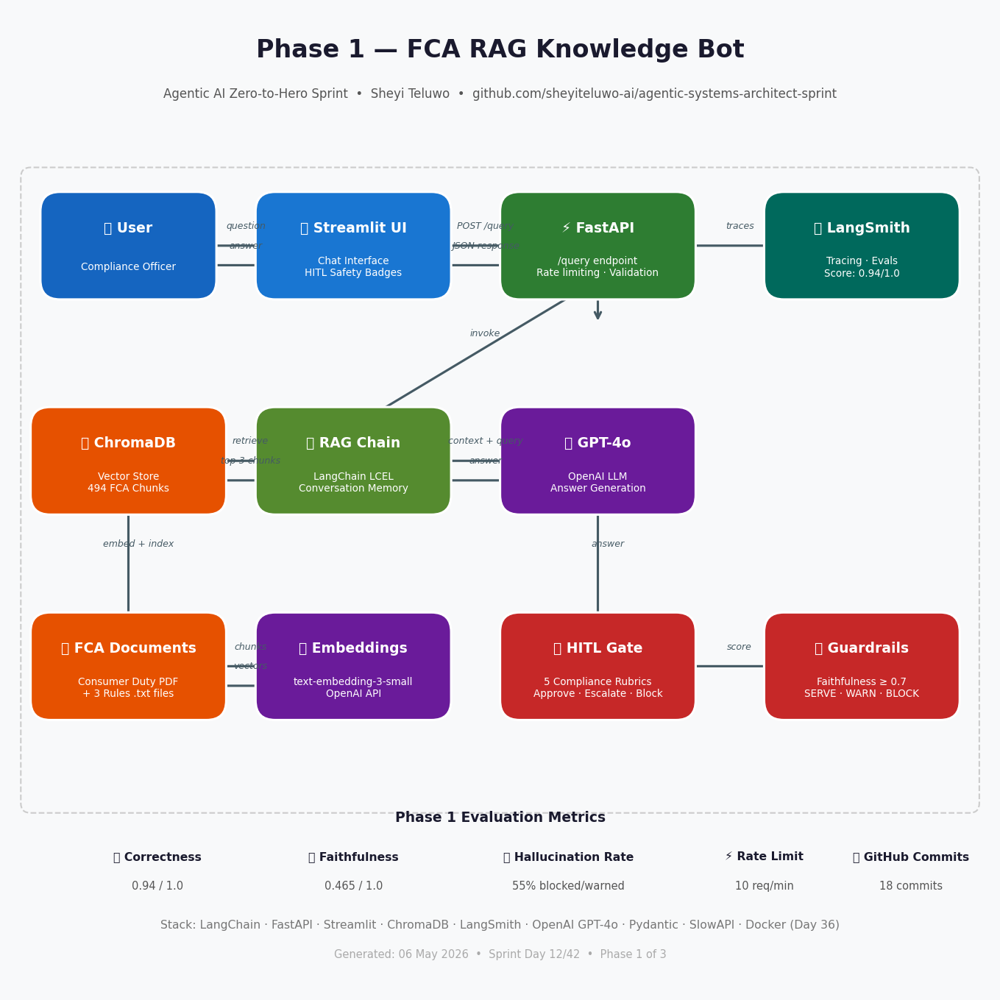

# 🤖 Agentic AI Zero-to-Hero Sprint
**42-Day Build in Public | UK Enterprise Edition**
Sheyi Teluwo | Target: £95k+ Salary / £850+ Day Rate
[github.com/sheyiteluwo-ai/agentic-systems-architect-sprint](https://github.com/sheyiteluwo-ai/agentic-systems-architect-sprint)

---

## 🎯 Sprint Goal
Build three production-grade agentic AI systems in 42 days,
targeting roles in UK regulated industries — FCA, Barclays, NHS,
Magic Circle law firms.

---

## 📐 System Architecture — Phase 1

---

## 🏗️ Phase 1 — FCA RAG Knowledge Bot (Days 1–14)
**Status: 12/14 days complete**

### What It Does
A production-hardened RAG system that answers FCA compliance
questions, grounded in real regulatory documents.

### Key Features
- ✅ 494 FCA document chunks indexed in ChromaDB
- ✅ Conversation memory with source citations
- ✅ LangSmith correctness eval — **0.94 / 1.0**
- ✅ LangSmith faithfulness eval — hallucination detection
- ✅ Human-in-the-loop (HITL) approval gate
- ✅ FastAPI REST wrapper with rate limiting
- ✅ Streamlit chat UI with HITL safety badges
- ✅ Production hardening — validation, logging, health checks
- ✅ Guardrails — SERVE / SERVE_WITH_WARNING / BLOCK

### Stack
| Component | Technology |
|---|---|
| LLM | OpenAI GPT-4o |
| Framework | LangChain LCEL |
| Vector Store | ChromaDB |
| API | FastAPI + SlowAPI |
| UI | Streamlit |
| Observability | LangSmith |
| Validation | Pydantic |
| Language | Python 3.14 |

### UK Use Case — Barclays FCA Compliance
A compliance officer can query FCA Consumer Duty, complaints
handling rules, and vulnerable customer obligations in plain
English. Every answer shows its source document page.
Escalations trigger the HITL gate for human review.

---

## 🏗️ Phase 2 — Multi-Agent Research Crew (Days 15–28)
**Status: Upcoming**
Magic Circle Legal Research Automation using CrewAI + LangGraph.

---

## 🏗️ Phase 3 — Enterprise MCP Architect (Days 29–42)
**Status: Upcoming**
NHS Patient Triage + Barclays Fraud Detection using Model
Context Protocol.

---

## 📊 Sprint Metrics (Day 12)

| Metric | Value |
|---|---|
| Days Complete | 12 / 42 |
| GitHub Commits | 18 |
| LinkedIn Posts | 8 scheduled |
| Eval Score (Correctness) | 0.94 / 1.0 |
| Eval Score (Faithfulness) | 0.465 / 1.0 |
| Hallucination Rate | 55% blocked or warned |
| Languages | Python 100% |

---

## 📁 File Structure