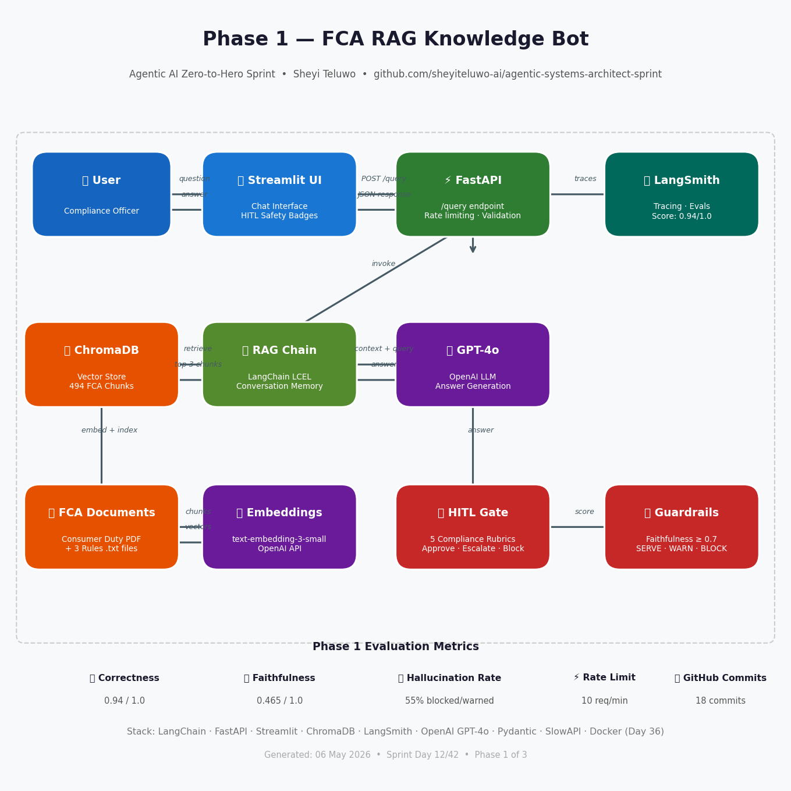

# 🤖 Agentic AI Zero-to-Hero Sprint
**42-Day Build in Public | UK Enterprise Edition**
Sheyi Teluwo | Target: £95k+ Salary / £850+ Day Rate
[github.com/sheyiteluwo-ai/agentic-systems-architect-sprint](https://github.com/sheyiteluwo-ai/agentic-systems-architect-sprint)

---

## 🎥 Phase 1 Demo
[Watch the full Phase 1 system walkthrough — 10 mins](https://www.loom.com/share/bec8aee08b784e55969551aa6bce593f)

---

## 🎯 Sprint Goal
Build three production-grade agentic AI systems in 42 days,
targeting roles in UK regulated industries — FCA, Barclays, NHS,
Magic Circle law firms.

---

## 📐 System Architecture — Phase 1



---

## 🏗️ Phase 1 — FCA RAG Knowledge Bot (Days 1–14)
**Status: ✅ COMPLETE**

### What It Does
A production-hardened RAG system that answers FCA compliance
questions, grounded in real regulatory documents.

### Key Features
- ✅ 494 FCA document chunks indexed in ChromaDB
- ✅ Conversation memory with source citations
- ✅ LangSmith correctness eval — **0.94 / 1.0**
- ✅ LangSmith faithfulness eval — hallucination detection
- ✅ Human-in-the-loop (HITL) approval gate — 5 compliance rubrics
- ✅ FastAPI REST wrapper with rate limiting
- ✅ Streamlit chat UI with HITL safety badges
- ✅ Production hardening — validation, logging, health checks
- ✅ Guardrails — SERVE / SERVE_WITH_WARNING / BLOCK
- ✅ Architecture diagram
- ✅ Barclays FCA pitch + CTO one-page summary
- ✅ 10-minute Loom demo recorded

### Stack
| Component | Technology |
|---|---|
| LLM | OpenAI GPT-4o |
| Framework | LangChain LCEL |
| Vector Store | ChromaDB |
| API | FastAPI + SlowAPI |
| UI | Streamlit |
| Observability | LangSmith |
| Validation | Pydantic |
| Language | Python 3.14 |

### UK Use Case — Barclays FCA Compliance
A compliance officer can query FCA Consumer Duty, complaints
handling rules, and vulnerable customer obligations in plain
English. Every answer shows its source document page.
Escalations trigger the HITL gate for human review.

### Business Case
- Time recovered per officer: 2 hours/day
- Annual value (10 officers): £169,000
- Build cost: £40k–£80k one-off
- Commercial alternative: £150k–£500k/year

---

## 🏗️ Phase 2 — Multi-Agent Research Crew (Days 15–28)
**Status: 🔄 In Progress**
Magic Circle Legal Research Automation using CrewAI + LangGraph.

---

## 🏗️ Phase 3 — Enterprise MCP Architect (Days 29–42)
**Status: ⬜ Upcoming**
NHS Patient Triage + Barclays Fraud Detection using Model
Context Protocol.

---

## 📊 Sprint Metrics (Day 14 — Phase 1 Complete)

| Metric | Value |
|---|---|
| Days Complete | 14 / 42 |
| GitHub Commits | 20 |
| LinkedIn Posts | 8 scheduled |
| Eval Score (Correctness) | 0.94 / 1.0 |
| Eval Score (Faithfulness) | 0.465 / 1.0 |
| Hallucination Rate | 55% blocked or warned |
| Loom Demo | ✅ Recorded |
| Beginner Benchmark | 112 hours |
| Sheyi Actual Hours | ~55 hours (2x faster) |
| Languages | Python 100% |

---

## 📁 File Structure

```
agentic-systems-architect-sprint/
├── day01_hello_agent.py
├── day02_rag_loader.py
├── day03_rag_memory.py
├── day04_prompt_engineering.py
├── day05_multi_doc_rag.py
├── day06_langsmith_evals.py
├── day07_hitl_and_fixes.py
├── day08_fastapi.py
├── day09_streamlit_ui.py
├── day10_production_hardening.py
├── day11_hallucination_detection.py
├── day12_readme_architecture.py
├── day13_use_case_framing.py
├── day14_demo_day.py
├── architecture_diagram.png
├── barclays_fca_pitch.md
├── barclays_cto_summary.md
├── eval_report_day06.json
├── eval_report_day11.json
├── PHASE1_COMPLETE.md
├── fca_consumer_duty.pdf
├── fca_complaints_extended.txt
├── fca_complaints_rules.txt
├── fca_vulnerable_customers.txt
├── requirements.txt
└── README.md
```

---

## 🔗 Connect
- LinkedIn: [linkedin.com/in/sheyi-teluwo](https://linkedin.com/in/sheyi-teluwo)
- GitHub: [github.com/sheyiteluwo-ai](https://github.com/sheyiteluwo-ai)
